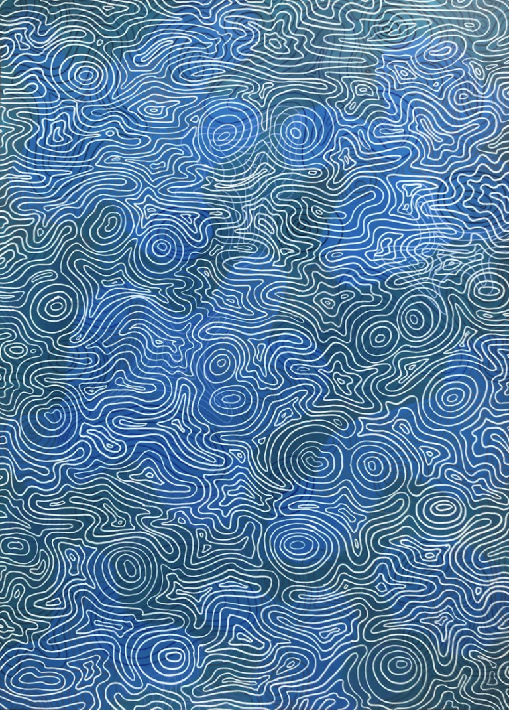

# ymen0136_9103_tut1
## Quiz 8

###  1.Imaging Technique Inspiration

Our team choose Wheels of fortune from Pacita Abad.


I find my imaging technique inspiration from a scene from The Matrix (1999). It is the mirror ripple effect. Neo touches a mirror and its surface ripples like water. 


1.ARCHI-ROCK

[Link Text](https://au.pinterest.com/pin/21321798205391577/)

2.Water Ripples Study II

[Link Text](https://jenniferbellart.com/products/water-ripples-study-ii?variant=44421163319536)


**Bold Text**

*Italic Text*

- Item 1
    -Subitem 1

1. Item 1
[Link Text](https://au.pinterest.com/pin/21321798205391577/)


```

function helloworld(){
    console.log"helloworld";
}
```
