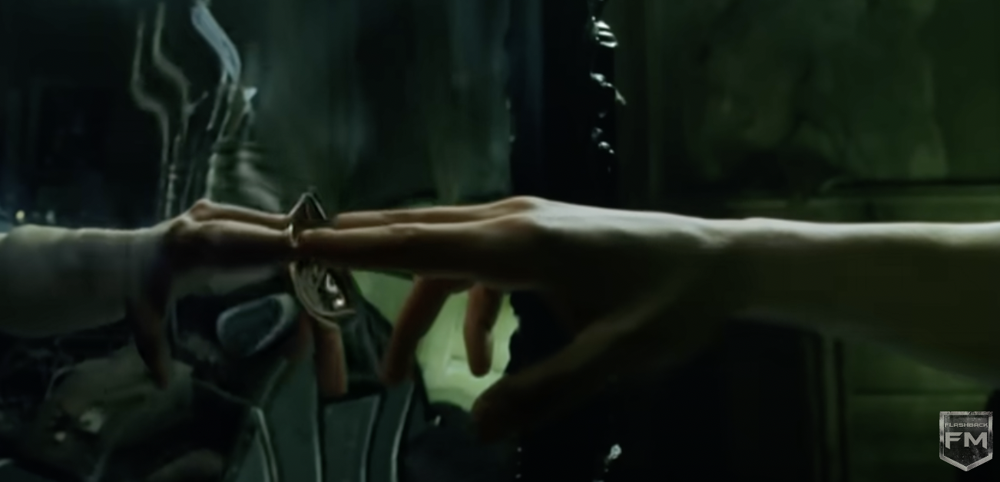

# ymen0136_9103_tut1
## Quiz 8

###  1.Imaging Technique Inspiration

Our team choose Wheels of fortune from Pacita Abad.

I found my imaging technique inspiration from a scene from The Matrix (1999). It is the mirror ripple effect. Neo touches a mirror and its surface ripples like water. 

There is a clip from this movie.
[mirror scene from The Matrix](https://www.youtube.com/watch?v=fnVQlwKAuLk)

Also, I found **two** artworks as inspiration for our project. We can combine these elements. When the mouse touches the circle, a regular circular ripple will spread out. As the ripple expands, the waves gradually become irregular, creating a more natural and complex ripple effect. This can create a sense of reality, making our project more dynamic and immersive.

-**ARCHI-ROCK**

[ARCHI-ROCK](https://au.pinterest.com/pin/21321798205391577/)

-**Water Ripples Study II**

[Water Ripples Study II](https://jenniferbellart.com/products/water-ripples-study-ii?variant=44421163319536)

###  2.Coding Technique Exploration

There are some coding example that might can help us to achieve this effect.

The **first** example, [mouse ripple](https://happycoding.io/tutorials/p5js/input/mouse-ripple), provides mouse interaction that creates an initial regular ripple upon touch.

The **second** example, [splashing](https://codepen.io/alexzaworski/pen/mEZvrG), showcases more complex visual effects, like water splashing.

The **third** example, [irregular ripple effect](https://codepen.io/vcomics/pen/ZwNgvX), uses technology to deliver natural water ripple expansion. By combining these techniques, I want to generate an interactive effect that transitions from regular ripples to irregular patterns, with the dynamic and immersive effects.

